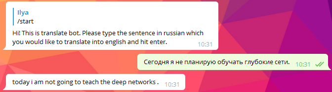

# tg-bot-translation
Bot performs sentence translation from Russian to English using Transformer. Dataset for training consists of 400k sentence pairs. 50k sentence pairs were taken from
[YSDA NLP](https://github.com/yandexdataschool/nlp_course) course data. They are mainly connected with various apartments descriptions. Another 350k sentence pairs
are from [Yandex parallel corpus](https://translate.yandex.ru/corpus?lang=en). These pairs are general purpose sentences. As a result, bot 
best translates sentences related to apartments and hotels descriptions. 

Transformer implementation from [DLS school seminar](https://drive.google.com/drive/u/0/folders/1uzNwvPY4rzmkogdWto-tnjsl26wk04Lw) was used. Number of encoder 
and decoder layers was chosen to be four. The model studied for 47 epochs. It reached 19.66 BLEU score on test set. During the last 15 epochs
BLEU score increased by just 0.3 points which indicates that further training is unlikely to improve inference results.

**Telegram bot** is written using [AIOGram](https://github.com/aiogram/aiogram) asynchronous framework. It is located in [bot](bot) folder. 
You should change paths in [config](bot/config.py) file in order to run it on your system. Do not forget to add your Telegram token as well.
Main entry point for bot initialization is [main.py](main.py) file. Bot name is @translate_tr_bot. 

  

